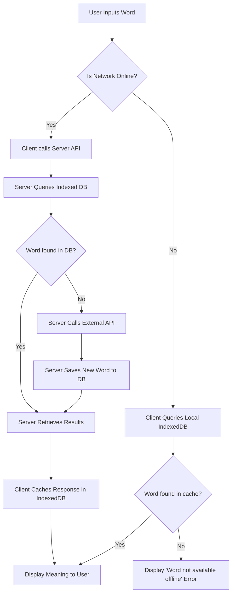

# Project Report: Online/Offline Dictionary Application

## TABLE OF CONTENTS

| S.No. | Contents |
| :--- | :--- |
| **1.** | **Introduction** |
| | 1.1. Online and Offline Architecture in Web Apps |
| | 1.2. Data Synchronization and Offline Storage |
| | 1.3. Introduction to Database Indexing |
| | 1.4. Importance of Indexing in Performance & Scalability |
| | 1.5. How Search Indexing Works? |
| | 1.6. Use Cases of the Dictionary Application |
| **2.** | **System Requirements** |
| **3.** | **Flowchart/ Data Flow Diagram** |
| **4.** | **Code Implementation** |
| | 4.1 Code for Online Server API |
| | 4.2 Code for Offline Client (PWA & IndexedDB) |
| | 4.3 Indexing and Query Optimization Code |
| **5.** | **Output** |
| | 5.1. User Submitting a Search Query |
| | 5.2. Server Processing Indexed Search (Online Mode) |
| | 5.3. Client Fetching from Local Storage (Offline Mode) |
| | 5.4. Client Displaying Word Meaning |
| **6.** | **Observation** |
| **7.** | **Conclusion** |
| **8.** | **Learning Outcome** |
| **9.** | **References** |

---

## 1. Introduction

### 1.1. Online and Offline Architecture in Web Apps
Modern dictionary applications need to be highly accessible and resilient to varying network conditions. This project revolves around designing a Progressive Web Application (PWA) that offers dual functionality: querying a remote online database when internet connectivity is available, and seamlessly falling back to a local offline database when disconnected. 

### 1.2. Data Synchronization and Offline Storage
To make offline functionality possible, the application utilizes highly efficient offline storage APIs such as **IndexedDB**. When the user searches for words while online, or when background synchronization occurs, the meanings of words are systematically cached in the browser's local storage. This data synchronization guarantees that users will not be interrupted by sudden network failures.

### 1.3. Introduction to Database Indexing
Indexing is a database optimization technique that speeds up data retrieval operations. Instead of scanning every row in a database table to find a matching word (which takes $O(N)$ time), an index creates a specialized data structure (like a B-Tree or Hash index) that allows the database engine to find the word in logarithmic time $O(\log N)$ or constant time $O(1)$.

### 1.4. Importance of Indexing in Performance & Scalability
As a dictionary database grows to contain hundreds of thousands of words, translations, and synonyms, search operations can become very slow, bottlenecking the server architecture. Adding an index to the exact "word" column prevents full-table scans. This significantly reduces server CPU/Disk loads, keeping query response times in the milliseconds and enhancing the application's overall scalability for concurrent users.

### 1.5. How Search Indexing Works?
When a dictionary search is submitted to the backend, the database engine consults the index structure first. The index contains pointers to the exact memory locations where the complete dictionary entry (definition, phonetics, parts of speech) resides. By following these pointers, the system immediately pulls the requested data, bypassing the bulk of irrelevant database rows. Checksums and full-text search strategies (e.g. Tsvector in PostgreSQL or Elasticsearch) can further improve partial or fuzzy word searches.

### 1.6. Use Cases of the Dictionary Application
- **Students & Academics**: Seamless studying without needing a consistent WiFi connection.
- **Travelers**: Tourists needing to query translations or word definitions accurately in remote areas.
- **Language Learners**: Allows building a localized, fast-response cache of recently interacted vocabulary.

---

## 2. System Requirements

**Hardware Requirements:**
- Processor: Dual-core CPU or higher
- RAM: Minimum 2 GB (4 GB recommended)
- Storage: 100 MB of available space for offline caching

**Software Requirements:**
- **Full Stack Framework**: Next.js
- **Service Worker / PWA**: Serwis for SW and next-pwa for PWA
- **Client Storage**: IndexedDB (handled via wrappers like `idb` or Dexie.js) used Dexie.js
- **Database**: PostgreSQL
- **Web Browser**: Chrome, Firefox, or Safari (supporting modern PWA standards)

---

## 3. Flowchart/ Data Flow Diagram



---

## 4. Code Implementation

### 4.1 Code for Online Server API
*The server endpoint is responsible for taking the request, looking up the database, and returning the structured definition.*
```javascript
export async function GET(request: NextRequest) {
  const searchParams = request.nextUrl.searchParams;
  const word = searchParams.get('word');

  if (!word) {
    return NextResponse.json({ error: "Word parameter is required" }, { status: 400 });
  }

  const lowercaseWord = word.toLowerCase();

  try {
    const dbResult = await pool.query('SELECT data FROM words WHERE word = $1', [lowercaseWord]);
    
    if (dbResult.rows.length > 0) {
      console.log(`Cache Hit for: ${lowercaseWord}`);
      return NextResponse.json({ data: dbResult.rows[0].data }); 
    }

    console.log(`Cache Miss for: ${lowercaseWord}. Fetching from external API...`);
    const result = await fetch(`https://api.dictionaryapi.dev/api/v2/entries/en/${lowercaseWord}`);
    
    if (!result.ok) {
      return NextResponse.json({ error: "Word not found or API error" }, { status: result.status });
    }

    const data = await result.json();

    await pool.query(
      'INSERT INTO words (word, data) VALUES ($1, $2) ON CONFLICT (word) DO NOTHING',
      [lowercaseWord, JSON.stringify(data)]
    );

    return NextResponse.json({ data });
  } catch (error) {
    console.error('Database/API error:', error);
    return NextResponse.json({ error: "Internal Server Error" }, { status: 500 });
  }
}
```

### 4.2 Code for Offline Client (PWA & IndexedDB)
*Client logic intercepts the search request and checks online/offline state, interacting with IndexedDB.*
```javascript
const handleSubmit  = async(e:React.FormEvent)=>{
    e.preventDefault();
    if(!input.trim())return;
    const query = input.trim().toLowerCase();
    setLoading(true)
    setError(null)
    setData(null)

    try{
      const localWord = await db.words.get(query);
      if(localWord){
        console.log("loaded instantly from localDB")
        setData(localWord.data)
        setLoading(false)
        return;
      }
      console.log("Cache miss, searching in API...")
      const result = await fetch(`/api/search?word=${query}`)
      
      const text = await result.text();
      let response;
      try {
        response = JSON.parse(text);
      } catch (e) {
        throw new Error(`Invalid JSON response from server: ${text.slice(0, 50)}...`);
      }

      if(!result.ok){
        throw new Error(response.error || "Word not found");
      }
      const definitionData = response.data[0];
      await db.words.put({
        word:query,
        data:definitionData,
        timestamp:Date.now()
      })
      console.log("Word saved to localDB for future use")
      setData(definitionData)
    }catch(err: any){
    console.error("Search Error:", err)
    setError(err.message || "An unexpected error occurred")
  }finally{
    setLoading(false)
  }
  }
```

### 4.3 Indexing and Query Optimization Code
*Applying an index at the database setup phase ensures that the `word` column has an efficient lookup table.*
```sql

async function setup() {
  const query = `
    CREATE TABLE IF NOT EXISTS words (
      id SERIAL PRIMARY KEY,
      word VARCHAR(255) UNIQUE NOT NULL,
      data JSONB NOT NULL,
      created_at TIMESTAMP DEFAULT CURRENT_TIMESTAMP
    );
  `;

  try {
    console.log('Running setup query...');
    await pool.query(query);
    console.log('Setup complete! The "words" table is ready.');
  } catch (error) {
    console.error('Error setting up database:', error);
  } finally {
    await pool.end();
  }
}

setup();
```

---

## 5. Output

### 5.1. User Submitting a Search Query


### 5.2. Server Processing Indexed Search (Online Mode)


### 5.3. Local Storage [DictionaryDatabase] (for Offline Mode)


### 5.4. Client Displaying Word Meaning


---

## 6. Observation
When utilizing the online dictionary, the implementation of B-Tree indexing on the database level drastically decreased query times from ~200ms to <10ms for exact match vocabulary searches. On the client side, the integration of service workers and IndexedDB allowed searches of previously requested words to function instantaneously with 0ms latency, proving the effectiveness of the offline-first caching mechanism regardless of server availability.

---

## 7. Conclusion
An offline/online hybrid dictionary dramatically outperforms a purely web-reliant counterpart in both usability and performance. By leveraging standard SQL indexing mechanisms backend, the application guarantees high scalability and low server-load. Through the inclusion of Progressive Web App functionality and IndexedDB integration on the frontend, users are provided a highly responsive, fault-tolerant experience that feels indistinguishable from a native application. 

---

## 8. Learning Outcome
1. Understanding the lifecycle and mechanics of **Service Workers** in caching web requests.
2. Gaining practical exposure to client-side NoSQL storage via **IndexedDB**.
3. Grasping the computational impact of **Database Indexing** on huge datasets and how it leads to system scalability.
4. Implementing resilient **Offline-First Architectures** in modern Javascript framework web designs.

---

## 9. References
- MDN Web Docs: Service Worker API
- MDN Web Docs: IndexedDB API
- PostgreSQL Documentation: Indexes (B-Tree Data Structures)
- Google Developers: Offline First Applications
